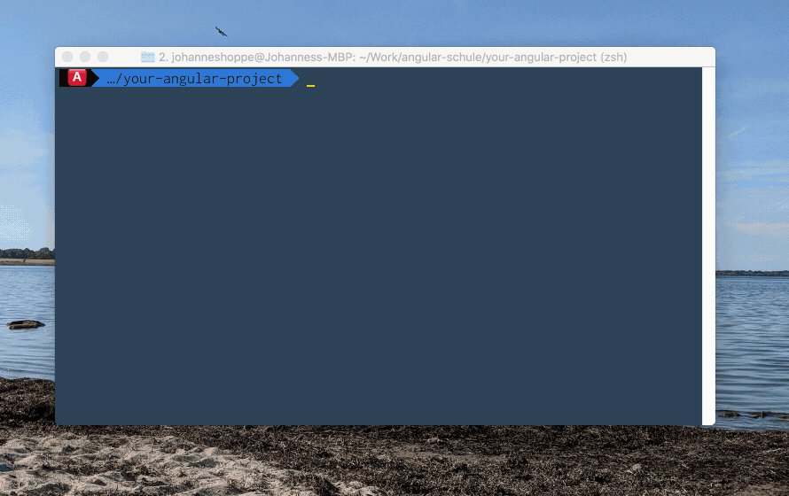

# angular-cli-ghpages
[![NPM version][npm-image]][npm-url]
[](https://circleci.com/gh/angular-schule/angular-cli-ghpages)
[](http://opensource.org/licenses/MIT)

**Deploy your Angular app to GitHub pages directly from the Angular CLI! 🚀**



**Table of contents:**  

1. [📖 Changelog](#changelog)
2. [⚠️ Prerequisites](#prerequisites)
3. [🚀 Quick Start (local development)](#quickstart-local)
4. [🚀 Continuous Delivery](#continuous-delivery)
5. [📦 Options](#options)
    - [--base-href](#base-href)
    - [--configuration](#configuration)
    - [--repo](#repo)
    - [--message](#message)
    - [--branch](#branch)
    - [--name & --email](#name)
    - [--no-silent](#no-silent)
    - [--no-dotfiles](#no-dotfiles)
    - [--cname](#cname)
    - [--dry-run](#dry-run)
6. [🏁 Next milestones](#milestones)
7. [⁉️ FAQ](#faq)


<hr>


## 📖 Changelog <a name="changelog"></a>

A detailed changelog is available in the [releases](https://github.com/angular-schule/angular-cli-ghpages/releases) section.

In the past this project was a standalone program.
This is still possible:
See the documentation at [README_standalone](docs/README_standalone).


## ⚠️ Prerequisites <a name="prerequisites"></a>

This command has the following prerequisites:

- Git 1.9 or higher (execute `git --version` to check your version)
- Angular project created via [Angular CLI](https://github.com/angular/angular-cli) v8.3.0-next.0 or greater (execute `ng update @angular/cli @angular/core --next=true` to upgrade your project if necessary)


## 🚀 Quick Start (local development) <a name="quickstart-local"></a>

This quick start assumes that you are starting from scratch.
If you already have an existing Angular project on GitHub, skip step 1 and 2.

1. Install the next version of the Angular CLI (v8.3.0-next.0 or greater) globally
   and create a new Angular project.

   ```sh
   npm install -g @angular/cli@next
   ng new your-angular-project --defaults
   cd your-angular-project
   ```

2. By default the Angular CLI initializes a Git repository for you.  
   To add a new remote for GitHub, use the `git remote add` command:

   ```sh
   git remote add origin https://github.com/<username>/<repositoryname>.git
   ```

   Hints:  
   * Create a new empty GitHub repository first.
   * Replace `<username>` and `<repositoryname>` with your username from GitHub and the name of your new repository. 
   * Please enter the URL `https://github.com/<username>/<repositoryname>.git` into your browser – you should see your existing repository on GitHub. 
   * Please double-check that you have the necessary rights to make changes to the given project!  

3. Add `angular-cli-ghpages` to your project.

   ```sh
   ng add angular-cli-ghpages
   ```

4. Deploy your project to GitHub pages with all default settings.
   Your project will be automatically built in production mode.

   ```sh
   ng deploy
   ```

   Which is the same as:

   ```sh
   ng run your-angular-project:deploy
   ```

5. Your project should be available at `https://<username>.github.io/<repositoryname>`.  
   Learn more about GitHub pages on the [official website](https://pages.github.com/).


## 🚀 Continuous Delivery <a name="continuous-delivery"></a>

If you run this command from a CI/CD environment, the deployment will most likely not work out of the box.
For security reasons, those environments usually have read-only privileges or you haven't set up Git correctly.
Therefore you should take a look at [GitHub tokens](https://help.github.com/articles/creating-an-access-token-for-command-line-use/).
In short: a GitHub token replaces username and password and is a safer choice because a token can be revoked at any time.

All you need to do is to set an environment variable called `GH_TOKEN` in your CI/CD environment.
You should also set the URL to the repository using the `--repo` option.
The URL must use the HTTPS scheme.

```sh
ng deploy --repo=https://github.com/<username>/<repositoryname>.git --name="Your Git Username" --email=your.mail@example.org
```

(replace `<username>` and `<repositoryname>` with your username from GitHub and the name of your repository)

> Please __do NOT disable the silent mode__ if you have any credentials in the repository URL!
> You have to treat the GH_TOKEN as secure as a password!


## 📦 Options <a name="options"></a>

#### --base-href <a name="base-href"></a>
 * __optional__
 * Default: `undefined` (string)
 * Example:
    * `ng deploy` -- `<base href="/">` remains unchanged in your `index.html`
    * `ng deploy --base-href=/the-repositoryname/` -- `<base href="/the-repositoryname/">` is added to your `index.html`

Specifies the base URL for the application being built.
Same as `ng build --base-href=/XXX/`

**ℹ️ Please read the next lines carefully, or you will get 404 errors in case of a wrong configuration!**

##### A) You don't want to use a custom domain

If you don't want to use an own domain, then your later URL of your hosted Angular project should look like this:
`https://your-username.github.io/the-repositoryname`.
In this case you have to adjust the `--base-href` accordingly:

```sh
ng deploy --base-href=/the-repositoryname/
```

##### B) You want to use a custom domain

If you want to use your own domain, then you don't have to adjust `--base-href`.
However, it is now necessary to set the `--cname` parameter!

```sh
ng deploy --cname=example.org
```

See the option [--cname](#cname) for more information!

#### --repo <a name="repo"></a>
 * __optional__
 * Default: URL of the origin remote of the current dir (assumes a Git repository)
 * Example: `ng deploy --repo=https://github.com/<username>/<repositoryname>.git`

By default, this command assumes that the current working directory is a Git repository,
and that you want to push changes to the `origin` remote.
If instead your files are not in a git repository, or if you want to push to another repository,
you can provide the repository URL in the `repo` option.

**Hint:**
Set an environment variable with the name `GH_TOKEN` and it will be automatically added to the URL.
(`https://github.com/<username>/<repositoryname>.git` is changed to `https://XXX@github.com/<username>/<repositoryname>.git`
if there is an environment variable `GH_TOKEN` with the value `XXX`.
Learn more about [GitHub tokens here](https://help.github.com/articles/creating-an-access-token-for-command-line-use/).)


#### --configuration <a name="configuration"></a>
 * __optional__
 * Default: `production` (string)
 * Example:
    * `ng deploy` -- Angular project is build in production mode
    * `ng deploy --configuration=qs` -- Angular project is using the configuration `qs` (this configuration must exist in the `angular.json` file)

A named build target, as specified in the `configurations` section of `angular.json`.
Each named target is accompanied by a configuration of option defaults for that target.
Same as `ng build --configuration=XXX`.


#### --message <a name="message"></a>
 * __optional__
 * Default: `Auto-generated commit` (string)
 * Example: `ng deploy --message="What could possibly go wrong?"`

The commit message, __must be wrapped in quotes__ if there are any spaces in the text.  
Some handy additional text is always added,
if the environment variable `TRAVIS` exists (for Travis CI) or
if the environment variable `CIRCLECI` exists (for Circle CI).


#### --branch <a name="branch"></a>
 * __optional__
 * Default: `gh-pages` (string)
 * Example: `ng deploy --branch=master`
 
The name of the branch you'll be pushing to.
The default uses GitHub's `gh-pages` branch,
but this can be configured to push to any branch on any remote.
You have to change this to `master` if you are pushing to a GitHub organization page (instead of a GitHub user page).


#### --name & --email <a name="name"></a>
 * __optional__
 * Default: value of `git config user.name` and `git config user.email`
 * Example: `ng deploy --name="Displayed Username" --email=mail@example.org`

If you run the command in a repository without `user.name` or `user.email` Git config properties
(or on a machine without these global config properties),
you must provide user info before Git allows you to commit.
In this case, provide **both** `name` and `email` string values to identify the committer.


#### --no-silent <a name="no-silent"></a>
 * __optional__
 * Default: silent `true` (boolean)
 * Example:
    * `ng deploy` -- Logging is in silent mode by default.
    * `ng deploy --no-silent` -- Logging shows extended information.

Logging is in silent mode by default.
In silent mode, log messages are suppressed and error messages are sanitized.

The `--no-silent` option enables extended console logging.
Keep this untouched if the repository URL or other information passed to git commands is sensitive!

> WARNING: This option should be kept as it is if the repository URL or other information passed to Git commands is sensitive and should not be logged (== you have a public build server and you are using the `GH_TOKEN` feature).
> By default the silent mode is enabled to avoid sensitive data exposure.


#### --no-dotfiles <a name="no-dotfiles"></a>
 * __optional__
 * Default: dotfiles `true` (boolean)
 * Example:
    * `ng deploy` -- Dotfiles are included by default.
    * `ng deploy --no-dotfiles` -- Dotfiles are ignored.

The command includes dotfiles by default (e.g `.htaccess` will be committed)
With `--no-dotfiles` files starting with `.` are ignored.

**Hint:**
This is super useful if you want to publish a `.nojekyll` file.
Create such a file in the root of your pages repo to bypass the Jekyll static site generator on GitHub Pages.
Static content is still delivered -- even without Jekyll.
This should only be necessary if your site uses files or directories that start with **_underscores** since Jekyll considers these to be special resources and does not copy them to the final site.
→ Or just don't use underscores!


#### --cname <a name="cname"></a>
 * __optional__
 * Default: `undefined` (string) -- No CNAME file is generated
 * Example:
    * `ng deploy --cname=example.com`

A CNAME file will be created enabling you to use a custom domain.
[More information on GitHub Pages using a custom domain](https://help.github.com/articles/using-a-custom-domain-with-github-pages/). 


#### --dry-run <a name="dry-run"></a>
 * __optional__
 * Default: `false` (boolean)
 * Example:
    * `ng deploy` -- Normal behavior: Changes are applied.
    * `ng deploy --dry-run` -- No changes are applied at all.

Run through without making any changes.
This can be very useful because it outputs what would happen without doing anything.


## 🏁 Next milestones <a name="milestones"></a>

We are glad that we have an integration into the CLI again.
However, we are looking forward to the following features:

* an interactive command-line prompt that guides you through the available options 
* a configuration file (`angular-cli-ghpages.json`) to avoid all these command-line cmd options
* your feature that's not on the list yet?

We look forward to any help. PRs are welcome! 😃


## ⁉️ FAQ <a name="faq"></a>

Before posting any issue, [please read the FAQ first](https://github.com/angular-schule/angular-cli-ghpages/wiki/FAQ).
See the contributors documentation at [README_contributors](docs/README_contributors) if you want to debug and test this project.


## License  <a name="license"></a>
Code released under the [MIT license](LICENSE).

<hr>

  

### &copy; 2019 https://angular.schule

This project is made on top of [tschaub/gh-pages](https://github.com/tschaub/gh-pages).  
Thank you very much for this great foundation!

[npm-url]: https://www.npmjs.com/package/angular-cli-ghpages
[npm-image]: https://badge.fury.io/js/angular-cli-ghpages.svg
