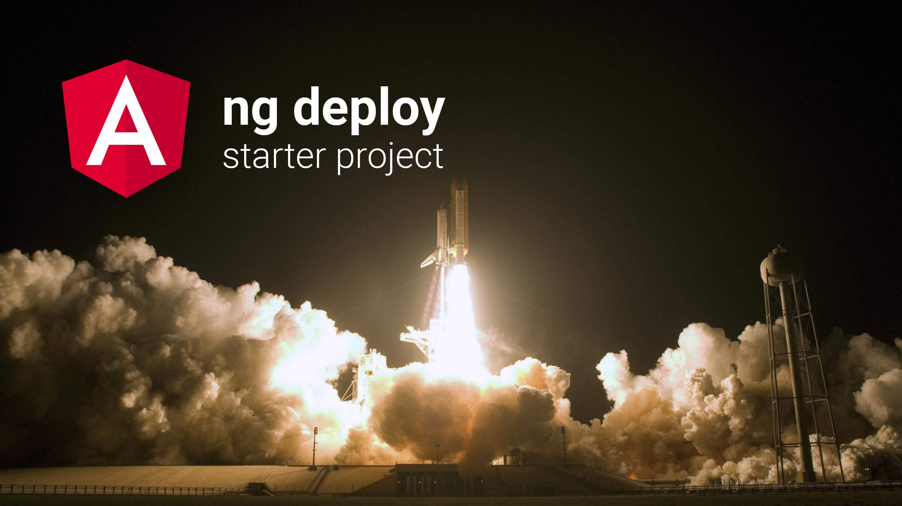

# @angular-schule/ngx-deploy-starter 🚀

[![NPM version][npm-image]][npm-url]

## About

This is a sample project that helps you to implement your own **deployment builder** (`ng deploy`) for the Angular CLI.
The groundwork of this starter was provided by Minko Gechev's [ngx-gh project](https://github.com/mgechev/ngx-gh).

This project has the following purposes:

**Goal 1:** To promote the adoption of `ng deploy` by providing a blueprint for new builders.  
**Goal 2:** To clarify various questions and to standardise the experience of the existing builders.

We hope for an inspiring discussion, pull requests and questions.

**If you don't know `ng deploy` yet, learn more about this command here:  
[👉 Blogpost: All you need to know about `ng deploy`](https://angular.schule/blog/2019-08-ng-deploy)**

## Goal 1: How to make your own deploy builder

We are there to assist you in creating a builder.

1. fork this repository
2. adjust the `package.json`
3. search and replace for the string `@angular-schule/ngx-deploy-starter` and `ngx-deploy-starter` and choose your own name.
4. search and replace for the string `to the file system` and name your deploy target.
5. add your deployment code to `src/engine/engine.ts`, take care of the tests
6. follow the instructions from the [contributors README](docs/README_contributors.md) for build, test and publishing.

You are free to customise this project according to your needs.
Please keep the spirit of Open Source alive and use the MIT or a compatible license.

## Goal 2: Best practices for deployment builders

This project also aims to be a reference for the existing builders.
Recommendations are made through RFCs (Request for Comments), and we are very pleased about their adoption.
[Here is a list of all existing RFCs](https://github.com/angular-schule/ngx-deploy-starter/issues?q=is%3Aissue+%5BRFC%5D).

## Projects based on ngx-deploy-starter

- [ngx-deploy-npm](https://github.com/bikecoders/ngx-deploy-npm) – Deploy your Angular Package to NPM directly from the Angular CLI! 🚀
- [angular-cli-ghpages](https://github.com/angular-schule/angular-cli-ghpages) – Deploy your Angular app to GitHub pages directly from the Angular CLI! 🚀

## License

Code released under the [MIT license](LICENSE).

[npm-url]: https://www.npmjs.com/package/@angular-schule/ngx-deploy-starter
[npm-image]: https://badge.fury.io/js/%40angular-schule%2Fngx-deploy-starter.svg
