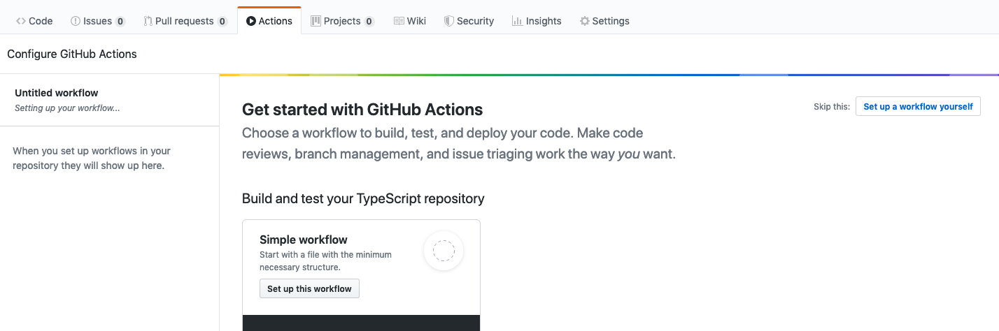

# angular-cli-ghpages: README for setting up deployment with GitHub Actions

As Github has introduced [Github Actions](https://github.com/features/actions), I would prefer to run all my CI tasks in it only, rather than going to some other CI providers. This guide is aimed to help out developers, who want to deploy their Angular app in Github Page using [angular-cli-pages](https://github.com/angular-schule/angular-cli-ghpages).

## Prerequisites

1. You've signed up for the GitHub Actions beta and taken a look at the documentation for the new [GitHub Actions](https://github.com/features/actions) format and/or understand the purpose of GitHub Actions.
2. You've written some form of YML code before and/or have minimal knowledge of the syntax
3. You already have a working Angular app that can be deployed to GitHub Pages
4. You have already added **angular-cli-ghpages** in your project. If not:
   - Please checkout [Quick Start Guide](https://github.com/angular-schule/angular-cli-ghpages#-quick-start-local-development-)
   - Or simply run `ng add angular-cli-ghpages` in your project.

## Getting started

Please ensure that you've read the prerequisites section before continuing with this section.

### Automatic GitHub Action Token

GitHub provides a token that you can use to authenticate on behalf of GitHub Actions.

GitHub automatically creates a `GITHUB_TOKEN` secret to use in your workflow.
You can use the `GITHUB_TOKEN` to authenticate in a workflow run.

More info can be found here:  
[help.github.com](https://help.github.com/en/actions/configuring-and-managing-workflows/authenticating-with-the-github_token#using-the-github_token-in-a-workflow)

### Setup Github Action Flow

1. Open up your Github repo.

2. Go to **Settings** . Then on the side bar, go to **Actions** then **General**.

3. Allow **Read and write permissions** under **Workflow permissions** .

4. Go to **Actions** and click on **Set up workflow yourself**.

   

5. A New File editor will open, keep the file name (e.g. _main.yml_) as it is, simply replace all content to below:

   ```yml
   name: Deploy to GitHub Pages via angular-cli-ghpages

   on: [push]

   jobs:
     build-and-deploy:
       runs-on: ubuntu-latest

       steps:
         - name: Checkout
           uses: actions/checkout@v4

         - name: Use Node.js 20.x
           uses: actions/setup-node@v4
           with:
             node-version: 20.x
             cache: "npm"

         - name: Install dependencies
           run: npm install

         - name: Run tests
           run: npm run ng -- test --no-watch --no-progress --browsers=ChromeHeadless

         - name: Prepare and deploy
           env:
             GITHUB_TOKEN: ${{ secrets.GITHUB_TOKEN }}
           run: npm run ng -- deploy --base-href=/the-repository-name/ --name="Displayed Username" --email="mail@example.org"
   ```

6. Make sure to replace **`/the-repository-name/`**, **`Displayed Username`** and **`mail@example.org`** with correct values in above snippet.
7. If you do not have tests you may remove the step "Run tests" from the example.
8. You can also control when your workflows are triggered:

   - It can be helpful to not have your workflows run on every push to every branch in the repo.

     - For example, you can have your workflow run on push events to master and release branches:

       ```yml
       on:
       push:
         branches:
           - master
           - release/*
       ```

     - or only run on pull_request events that target the master branch:

       ```yml
       on:
         pull_request:
           branches:
             - master
       ```

     - or, run every day of the week from Monday - Friday at 02:00:

       ```yml
       on:
         schedule:
           - cron: 0 2 * * 1-5
       ```

   - For more information see [Events that trigger workflows](https://help.github.com/articles/events-that-trigger-workflows) and [Workflow syntax for GitHub Actions](https://help.github.com/articles/workflow-syntax-for-github-actions#on).

9. Commit and Push to add the workflow file.
10. Done.

---

# Still questions?

Learn everything you need to know in the following extended article.

[](https://angular.schule/blog/2020-01-everything-github)

**Everything GitHub: Continuous Integration, Deployment and Hosting for your Angular App**

In this article we show several tools from the GitHub universe to launch a website with Angular. We will establish a professional pipeline, including version management, continuous deployment and web hosting. Best of all, for public repositories, this will not cost you a single cent! [Read more...](https://angular.schule/blog/2020-01-everything-github)
